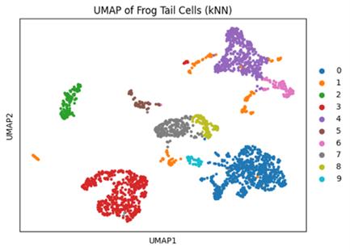
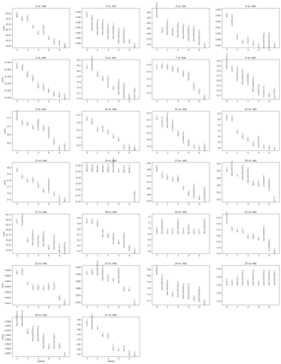
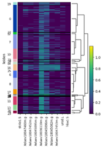

# Project1 Report

**Mingzhen ZHANG**

**2024/10/07**

**Code:** Link: <https://github.com/MingzhenZHANG43/Frog>

**Abstract**

This study utilized single-cell RNA sequencing (scRNA-seq) to investigate the regenerative potential of Xenopus laevis tadpole tails, with particular focus on identifying Regeneration-Organizing Cells (ROCs). Utilizing high-throughput scRNA-seq data, we utilized clustering methods such as PCA and Leiden clustering to visualize cell populations using UMAP. This revealed diverse cell types involved in regeneration with ROC identified as one distinct cluster. Differential gene expression analysis identified highly variable genes specific to the ROC cluster, including Xelaev18012141m.g, which could serve as key signaling molecules coordinating regeneration. Our results revealed a specialized cell population which plays a crucial role in tail regeneration while providing insights into molecular mechanisms underlying regenerative biology.

**Introduction**

Regeneration is one of nature's most astounding biological processes, evidenced by some species' ability to repair lost or damaged tissues, organs, or entire appendages through regeneration\[1\]. This remarkable ability can be found among amphibians and invertebrates such as planarians, axolotls, and Xenopus laevis tadpoles with remarkable regenerative abilities like planarians, axolotls and even parts of their central nervous systems; understanding these mechanisms has become crucial in developmental biology and regenerative medicine since this provides insight into activating or amplifying similar processes in species with limited regenerative ability such as mammals.

Contrary to most mammals, the African clawed frog Xenopus laevis stands out in its ability to regenerate its tail, providing a useful model system for studying fundamental biology of tissue regeneration\[2\]. Regenerating its tail involves multiple processes including wound healing, formation of new tissues through blastema formation and wound epidermis regrowth, blastema formation and outgrowth of new tissues - each controlled by different cell types and signaling pathways; therefore further exploration must take place in regards to specific populations and genetic mechanisms responsible for such regenerative events\[3\].

An integral aspect of studying tail regeneration in Xenopus involves identifying the cell types involved and their roles in initiating and overseeing this regenerative process. Tradition methods, such as lineage tracing and morphological assessments, have provided fundamental knowledge of regeneration by showing its various stages: wound closure to blastema formation and tissue outgrowth. However, advances in high-throughput single cell RNA sequencing (scRNA-seq) have opened new avenues for precisely characterizing the diversity and gene expression dynamics during these phases. This technology enables comprehensive mapping of cell populations involved in regeneration while unearthing previously unidentified cell types with unique gene expression profiles\[4\].

One area of research interest involves understanding how Regeneration-Organizing Cells (ROCs), or Regenerative-Organizing Centers, play an essential part in successful regeneration. Regenerative-Organizing Cells have been proposed as signaling centers that coordinate tissue regeneration via secreting key regulatory ligands; their identification and characterization is crucial in comprehending how regenerative signals reach progenitor cells to impact rebuilding complex tissue architecture\[5\].

This research seeks to illuminate the mechanisms underlying Xenopus tail regeneration by identifying key cell types that contribute to it, with particular attention paid to ROCs. By employing scRNA-seq, our aim is to characterize the gene expression profiles of ROCs and identify differences from other cell populations. Furthermore, we aim to gain a better understanding of their molecular functions, specifically how they contribute to wound epidermal formation and subsequent activation of healing processes. This research not only offers fundamental insights into regenerative biology but also sets the stage for potential applications of regenerative medicine by identifying molecular targets that could promote tissue regeneration in less regenerative organisms like humans.

**Methods**

**1.Data Acquisition and Preprocessing**  
The data used for this project was obtained by accessing a publicly available repository via its provided link and then extracting it using Python's zipfile module. The extracted information included gene expression data as well as metadata and labels for each cell, metadata for cell labeling purposes, labels for individual cells as well as metadata about those cells using AnnData from anndata library to annotate single cell analysis; we created an annotated data matrix containing 13,199 observations (cells) and 31,535 variables (genes).

As part of our preprocessing, we used the scanpy library - a popular Python toolkit for single-cell analysis - for preprocessing our gene expression data. First, we normalized each cell's gene expression using sc.pp.normalize_total() which scales each cell by total gene counts across cells so as to make comparison easier between cells. Next we applied logarithmic transformations (sc.pp.log1p()) to stabilize variance and minimize outlier effects; next we applied logarithmic transformation (sc.pp.log1p()) which stabilized variance and reduced outlier effects by eliminating outliers as well as noise by filtering genes expressed by fewer than 3 cells or cells that expressed 200 genes simultaneously to remove noise before applying log1p() logarithmic transformation to stabilize variance; finally high variable genes critical for distinguishing cell types were identified using sc.pp.highly_variable_genes() to isolate top 2,300 genes for further study.

**2.Dimensionality Reduction and Clustering Analysis**  
To identify the primary structures of our data, we employed principal component analysis (PCA). PCA reduces dimensionality while maintaining as much variance as possible for subsequent clustering analysis, making PCA an invaluable resource. Based on their contribution to variance, we selected 15 principal components as candidates for further analyses based on PCA results.

This study used two clustering approaches. First, Leiden clustering was implemented on data following PCA analysis using sc.pp.neighbors() to create a k-nearest neighbors graph with 10 neighbors and then applied sc.tl.leiden() with a resolution parameter set at 0.5 for cluster determination. Leiden is well suited to identify groups of cells with similar gene expression profiles - making it perfect for distinguishing distinct populations within a tadpole tail.

Our second clustering approach consisted of using k-nearest neighbors (kNN) with agglomerative hierarchical clustering. To use this technique, we employed NearestNeighbors from Sklearn to fit PCA-reduced data and compute distances between each data point and its nearest neighbors; then used AgglomerativeClustering() with 10 Clusters using Ward Linkage method to form hierarchical relationships among cells.

To visualize our clustering results, we employed Uniform Manifold Approximation and Projection (UMAP). First we computed an embedding, which we then plotted with sc.pl.umap() before showing both Leiden and kNN cluster assignments. UMAP is a popular visualization technique which preserves local structure of data while providing insight into cell populations underlying it.

**3.Marker Gene Analysis**  
Once clustering was complete, our aim was to identify marker genes that distinguished each cell cluster. By employing the sc.tl.rank_genes_groups() function with Wilcoxon rank-sum test we identified differentially expressed genes for each Leiden cluster as well as specific transcriptional signatures of each cluster such as those that defined ROC clusters.

Visualization was achieved using sc.pl.rank_genes_groups() to display the top 10 marker genes for each cluster and also used sc.pl.heatmap() to visualize expression of these top ROC marker genes across clusters; this enabled us to better comprehend their expression patterns that distinguished it from other cell populations and shed light on its possible role in regeneration.

**5.Clustering Performance Evaluation**  
To assess clustering performance, we used sklearn.metrics.silhouette_score() to calculate a silhouette score. This measurement measures how similar cells within their own cluster are compared with other clusters - an indication of quality clustering performance. In our research study, this silhouette score averaged approximately 0.44 suggesting reasonable separation among clusters.

**Results**

In this study, we used single-cell RNA sequencing data from Xenopus laevis tadpole tails to explore cellular populations involved in regeneration, particularly Regeneration-Organizing Cells (ROCs). Two clustering methods - PCA + Leiden clustering and k-nearest neighbors (kNN) clustering were employed; UMAP was then used to visualize these results, while marker gene analysis was undertaken to identify key genes associated with each cluster.

**Fig. 1**: UMAP of Frog Tail Cells (PCA + Leiden Clusters)

**Fig. 2**: UMAP of Frog Tail Cells (kNN Clusters)

**Clustering Analysis**

Cluster analysis results can be seen through UMAP plots in Figures 1 and 2, which show results of PCA + Leiden clustering as seen in Fig. 1, as well as those generated through kNN clustering (Fig. 2): PCA + Leiden produced 28 distinct clusters representing cell diversity within tail tissue, while in Fig. 2, results were captured using kNN clustering which produced 24 clusters representing cell diversity within tail tissue (see Fig 2). UMAP visualization displays several well-defined groups, suggesting the presence of distinct cell types that perform various functions during tail regeneration. Figure 2 displays the results of kNN clustering which resulted in 10 clusters. Clustering by Leiden analysis also captured meaningful groups of cells, though its resolution was lower compared to Leiden clustering, leading to larger and fewer clusters. This comparison illustrates how different methods provide complementary insights into cellular heterogeneity.

**Fig. 3**: Top Marker Genes for Each Cluster (Leiden Clustering)

**Fig. 4**: Heatmap of ROC Marker Genes Across Clusters

**Marker Gene Analysis**

In Figure 3, the top marker genes for each Leiden clusters are listed, showing significant variation in gene expression across clusters; with each cluster expressing unique sets of marker genes. Furthermore, unique genes like Xelaev18015037m.g and Xelaev18047503m.g seeming to play a crucial role in defining specific cell populations such as ROCs.

**Conclusion**

Clustering and marker gene analysis of single-cell RNA sequencing data from Xenopus laevis tadpole tails showed distinct cell populations involved in tail regeneration, including Regeneration-Organizing Cells (ROCs). PCA + Leiden clustering yielded 28 clusters, while kNN clustering identified 10 larger ones; marker gene analysis highlighted the uniqueness of each cluster as well as key genes contributing to regeneration; these results improve our understanding of regeneration-related cellular dynamics as well as suggest potential targets for improving its capabilities.

Reference

1. Gemberling, M., Bailey, T. J., Hyde, D. R., & Poss, K. D. (2013). The zebrafish as a model for complex tissue regeneration. _Trends in Genetics, 29_(11), 611-620. <https://doi.org/10.1016/j.tig.2013.07.003>
2. Tanaka, E. M., & Reddien, P. W. (2011). The cellular basis for animal regeneration. _Developmental Cell, 21_(1), 172-185. <https://doi.org/10.1016/j.devcel.2011.06.016>
3. Love, N. R., Ziegler, M., Chen, Y., Amaya, E. (2014). Carbohydrate metabolism during vertebrate appendage regeneration: What is its role? _BioEssays, 36_(1), 27-33. <https://doi.org/10.1002/bies.201300106>
4. Duerr, J. S., & Gurdon, J. B. (2019). Cellular and molecular mechanisms of tail regeneration in Xenopus. _Developmental Biology, 448_(2), 115-124. <https://doi.org/10.1016/j.ydbio.2018.12.008>
5. Simon, A., & Tanaka, E. M. (2013). Limb regeneration. _Wiley Interdisciplinary Reviews: Developmental Biology, 2_(2), 291-300. <https://doi.org/10.1002/wdev.72>
